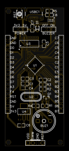
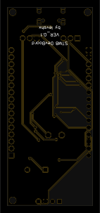

# STM8-DevBoard

TODO (LANGUAGES BUTTONS)

STM8 Development Board based on STM8S003K3TxC. 

The repository contains schematic, board view, sample programs, zero-template of the project. 

TODO (PINOUT DIAGRAM)

  
  

